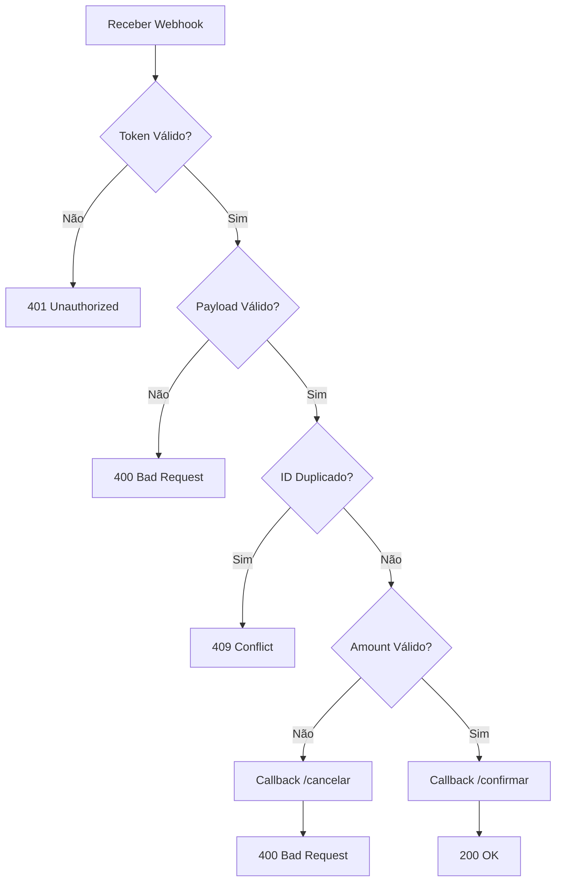

# Scala Webhook Server 🚀

Um servidor webhook funcional implementado em Scala usando http4s, Cats Effect e programação funcional pura. O projeto demonstra como processar webhooks de forma assíncrona, validar payloads, gerenciar estado compartilhado e realizar callbacks HTTP.

## 📋 Funcionalidades

- **Processamento de Webhooks**: Recebe e processa payloads JSON via HTTP POST
- **Validação de Token**: Autenticação baseada em token personalizado
- **Prevenção de Duplicatas**: Controle de transações já processadas
- **Callbacks Assíncronos**: Notificações automáticas para endpoints externos
- **Tratamento de Erros**: Respostas HTTP apropriadas para diferentes cenários
- **Programação Funcional**: Implementação usando IO monad e composição funcional

## 🏗️ Arquitetura

O projeto segue princípios de programação funcional:

- **Imutabilidade**: Todos os dados são imutáveis
- **Efeitos Controlados**: Uso de `IO` monad para gerenciar side effects
- **Composição**: Funções pequenas e composáveis
- **Type Safety**: Uso de opaque types para maior segurança de tipos
- **Resource Management**: Gerenciamento automático de recursos com `Resource`

## 🛠️ Tecnologias Utilizadas

- **Scala 3.4.2** - Linguagem de programação
- **http4s 0.23.27** - Framework web funcional
- **Cats Effect 3.5.4** - Biblioteca para programação funcional assíncrona
- **Circe 0.14.9** - Parsing e serialização JSON funcional
- **sbt** - Ferramenta de build

## 📦 Instalação

### Pré-requisitos

- **Java 11+** 
- **sbt 1.11+**
- **Python 3.7+** (para testes)

### Verificar Instalação

```bash
# Verificar Java
java -version

# Verificar sbt
sbt --version

# Verificar Python (para testes)
python3 --version
```

### Clonar e Compilar

```bash
# Clone o repositório
git clone <seu-repositorio>
cd ScalaWebhook

# Compilar o projeto
sbt compile

# Executar testes (se houver)
sbt test
```

## 🚀 Como Executar

### 1. Iniciar o Servidor Webhook

```bash
sbt run
```

O servidor iniciará em `http://localhost:5000` e exibirá:
```
🚀 Servidor online em http://localhost:5000/
Pressione CTRL+C para parar...
```

### 2. Executar Testes com Python

Em outro terminal, execute o script de teste:

```bash
# Instalar dependências Python
pip install requests fastapi uvicorn

# Executar todos os testes
python3 test_webhook.py

# Executar com parâmetros customizados
python3 test_webhook.py payment_success tx123 100.50 USD 2023-10-01T12:00:00Z meu-token-secreto
```

## 📊 Cenários de Teste

O script Python testa 6 cenários diferentes:

1. **✅ Transação Válida**: Payload correto com token válido
2. **❌ Transação Duplicada**: Mesmo transaction_id enviado novamente
3. **❌ Valor Inválido**: Amount = 0.00 ou negativo
4. **❌ Token Inválido**: Token de autenticação incorreto
5. **❌ Payload Inválido**: JSON malformado ou vazio
6. **❌ Campos Ausentes**: Campos obrigatórios faltando

## 🔧 Configuração

### Webhook Token

O token padrão é `"meu-token-secreto"`. Para alterar:

```scala
private val config = WebhookConfig(WebhookToken("seu-novo-token"))
```

### Portas e Hosts

```scala
final case class WebhookConfig(
    validToken: WebhookToken,
    serverHost: String = "localhost",    // Host do servidor webhook
    serverPort: Int = 5000,             // Porta do servidor webhook
    callbackHost: String = "127.0.0.1", // Host para callbacks
    callbackPort: Int = 5001            // Porta para callbacks
)
```

## 📝 API Endpoints

### POST /webhook

Recebe payloads de webhook para processamento.

**Headers:**
```
Content-Type: application/json
X-Webhook-Token: meu-token-secreto
```

**Payload:**
```json
{
  "event": "payment_success",
  "transaction_id": "abc123",
  "amount": "49.90",
  "currency": "BRL",
  "timestamp": "2023-10-01T12:00:00Z"
}
```

**Respostas:**
- `200 OK` - Webhook processado com sucesso
- `400 Bad Request` - Payload inválido ou campos ausentes
- `401 Unauthorized` - Token inválido ou ausente
- `409 Conflict` - Transaction ID duplicado
- `500 Internal Server Error` - Erro interno do servidor

## 🔄 Fluxo de Processamento



## 🧪 Exemplo de Teste Manual

```bash
# Teste de sucesso
curl -X POST http://localhost:5000/webhook \
  -H "Content-Type: application/json" \
  -H "X-Webhook-Token: meu-token-secreto" \
  -d '{
    "event": "payment_success",
    "transaction_id": "test123",
    "amount": "25.50",
    "currency": "BRL",
    "timestamp": "2023-10-01T12:00:00Z"
  }'

# Teste com token inválido
curl -X POST http://localhost:5000/webhook \
  -H "Content-Type: application/json" \
  -H "X-Webhook-Token: token-errado" \
  -d '{
    "event": "payment_success",
    "transaction_id": "test456",
    "amount": "25.50",
    "currency": "BRL",
    "timestamp": "2023-10-01T12:00:00Z"
  }'
```

## 📚 Estrutura do Projeto

```
ScalaWebhook/
├── build.sbt                 # Configuração do build
├── src/main/scala/
│   └── WebhookApp.scala      # Aplicação principal
├── test_webhook.py           # Script de testes Python
└── README.md                 # Este arquivo
```
